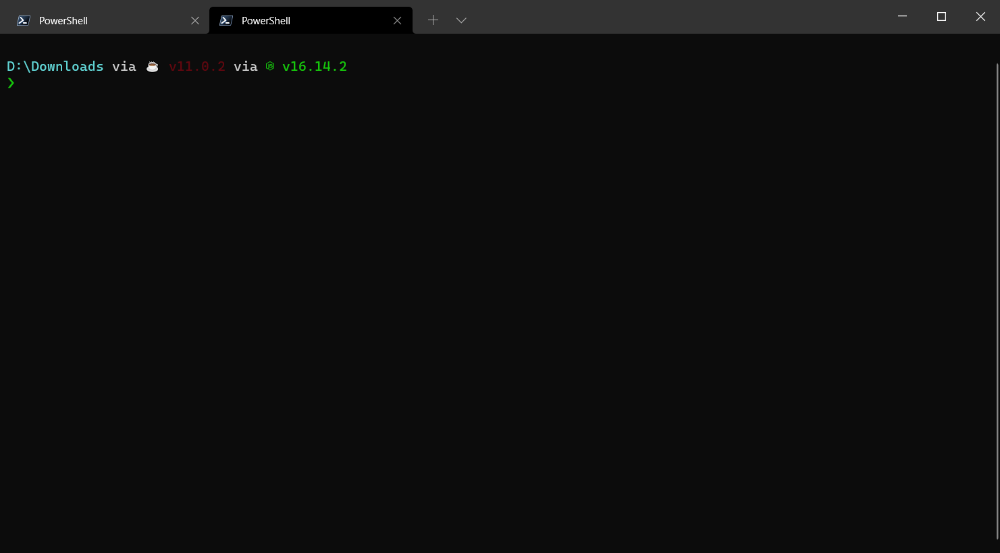

# ipatool.ts

`ipatool` is a command line tool that allows you to search and download iOS apps on the App Store.

This is heavily inspired by the OG [majd/ipatool](https://github.com/majd/ipatool), and as such has
similar command-line args.

However, this tool should work on any platform with Node.

